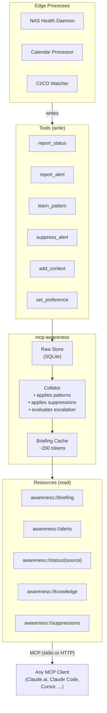

# mcp-awareness

> **Every system tells you what's happening. None of them tell you why.**

> [!NOTE]
> This project is a **proof of concept**. See [Current status](#current-status) for what's implemented vs. planned.

## Background

This project started with a single memory instruction in Claude.ai:

> *"On the first turn of each conversation, call `synology-admin:get_resource_usage`. If CPU > 90%, RAM > 85%, any disk > 90% busy, or network/disk I/O looks abnormally high, briefly mention it as an FYI before responding."*

That worked surprisingly well. Infrastructure awareness surfaced inline during unrelated conversations. The agent applied contextual judgment — it knew the NAS was a seedbox, so it didn't flag normal seeding activity. Conversational tuning worked too: "don't bug me until it's 97%" adjusted behavior immediately.

But it had obvious limits. Diagnostics weren't captured at detection time (by the time you asked "why is CPU high?", the spike might be over). There was no structural detection — if a key process stopped, every metric looked *better*, and nothing alerted. Knowledge lived in platform-locked memory. It only worked with one system, on one platform.

The [original LinkedIn post](https://www.linkedin.com/posts/cmeans_mcp-modelcontextprotocol-platformengineering-activity-7440439710315098112-Fstj) tells the full story of how this pattern emerged.

`mcp-awareness` is the generalization of that experiment. The goals:

- **Multi-source awareness** — any number of edge processes (NAS daemons, calendar processors, CI/CD watchers) write to one store
- **Structural detection** — catch when the *shape* of a system changes, not just when a number crosses a line
- **Externalized knowledge** — operational patterns learned through conversation belong to the *system*, not to any single agent or platform
- **Token efficiency** — a pre-computed briefing (~200 tokens) so agents don't burn context discovering "nothing is wrong"
- **Platform portability** — any MCP client reads the same store (Claude.ai, Claude Code, Cursor, future LLMs)

## Three-layer detection

| Layer | Question | Catches |
|-------|----------|---------|
| **Threshold** | "Is this number too high?" | CPU > 90%, disk > 95% full |
| **Baseline** | "Is this abnormal for THIS system?" | Deviation from rolling average |
| **Knowledge** | "Does this match what I expect?" | Process stopped, replication stalled, SKU absent from orders |

The third layer is where the value is. Knowledge accumulates through conversation, not YAML.

## Architecture



The agent reads `awareness://briefing` at conversation start. If `attention_needed` is true, it mentions the issue. If not, silence. Drill-down resources are available when the user asks for details.

## Quick start

```bash
# Install
pip install -e .

# Run via stdio (default, for direct MCP client integration)
mcp-awareness

# Run via HTTP (for remote clients, edge agents, mobile)
AWARENESS_TRANSPORT=streamable-http mcp-awareness
# → Listening on http://0.0.0.0:8420/mcp

# Custom data directory
AWARENESS_DATA_DIR=./my-data mcp-awareness
```

### Environment variables

| Variable | Default | Description |
|----------|---------|-------------|
| `AWARENESS_TRANSPORT` | `stdio` | Transport: `stdio` or `streamable-http` |
| `AWARENESS_HOST` | `0.0.0.0` | Bind address (HTTP mode) |
| `AWARENESS_PORT` | `8420` | Port (HTTP mode) |
| `AWARENESS_DATA_DIR` | `./data` | SQLite database directory |

### Claude Desktop / Claude Code config

**stdio** (local):
```json
{
  "mcpServers": {
    "mcp-awareness": {
      "command": "mcp-awareness"
    }
  }
}
```

**HTTP** (remote):
```json
{
  "mcpServers": {
    "mcp-awareness": {
      "url": "http://your-host:8420/mcp"
    }
  }
}
```

### Docker

```bash
docker compose up -d
# → HTTP server on port 8420
```

## Current status

**Working end-to-end** — tested from an Android phone via Cloudflare Tunnel → HTTP transport → Claude.ai reading a structural alert briefing. See the [PoC Demo Guide](docs/poc-demo.md) to reproduce this yourself.

<p align="center">
  
</p>

**Implemented:**
- Awareness service with SQLite store (WAL mode), collation engine, and full MCP API (6 resources + 11 tools)
- Dual read path: MCP resources for clients that support them, read tools (`get_briefing`, `get_alerts`, etc.) for tools-only clients like Claude.ai
- Streamable HTTP transport (`AWARENESS_TRANSPORT=streamable-http`) alongside stdio
- Layer 1 (threshold) detection via alert levels from edge processes
- Layer 3 (knowledge) detection via keyword-based pattern matching — learned patterns suppress expected anomalies
- Suppression system with time-based expiry and escalation overrides (critical breaks through warning-level suppression)
- Briefing generation targeting ~200 tokens all-clear, ~500 with issues
- 107 tests, strict type checking, CI pipeline

**Not yet implemented:**
- Layer 2 (baseline) detection — rolling averages and deviation calculation are planned but not built
- Edge processes — no producers exist yet; the store works but nothing writes to it in production ([example script](examples/simulate_edge.py) demonstrates the write path)
- Semantic pattern matching — current matching is keyword-based; RAG/vector similarity is a future consideration for complex natural-language patterns

## Design docs

- [PoC Demo Guide](docs/poc-demo.md) — step-by-step walkthrough to reproduce the end-to-end demo
- [From Metrics to Mental Models](docs/from-metrics-to-mental-models.md) — core spec: three-layer detection model, API design, data schema, implementation priorities
- [Collation Layer](docs/collation-layer.md) — addendum: briefing resource, token optimization, escalation logic, backend placement

## Acknowledgements

This project was designed and built through a collaborative process between [Chris Means](https://github.com/cmeans) and [Claude](https://claude.ai) (Anthropic's AI assistant). The architecture emerged from real-world experience with a homelab seedbox — Chris identified the pattern gap (monitoring that can't see structural changes), and the design was developed iteratively through conversation. Claude contributed to the architecture documents, implemented the codebase, and wrote the tests. Every design decision was discussed and validated by Chris before being committed.

The collaboration model itself is part of what this project explores: AI agents that build up operational knowledge through conversation rather than configuration. The awareness service is, in a sense, a formalization of how that collaboration already works — just extended to infrastructure.

## License

Apache 2.0 — see [LICENSE](LICENSE) for details.

---

Copyright (c) 2026 Chris Means
