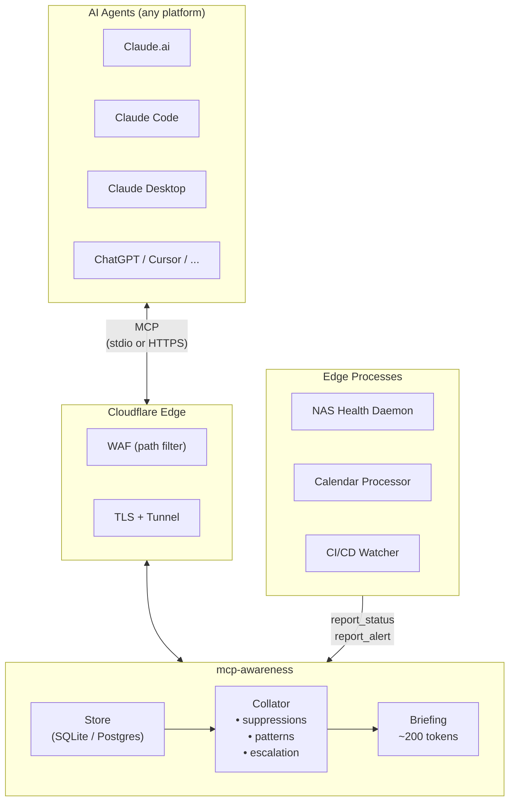

# mcp-awareness

> **Your AI's knowledge shouldn't be locked in one platform's memory. It should be yours.**

> [!NOTE]
> This project is a **proof of concept** that is rapidly evolving. See [Current status](#current-status) for what's implemented vs. planned.

## What this is


`mcp-awareness` is a portable knowledge and awareness layer for AI agents. It gives any MCP-compatible AI assistant — Claude, ChatGPT, Cursor, or whatever comes next — access to a shared store of knowledge, system status, and operational context that *you* own and control.

**The problem it solves:** Every AI platform has its own memory silo. Knowledge you build up in Claude doesn't exist in ChatGPT. Context from your desktop assistant doesn't follow you to mobile. If you switch platforms, you start over. Your AI knows you — but only within its walled garden.

**What `mcp-awareness` does:** It externalizes that knowledge into a self-hosted service that any agent can read from and write to, using the open [Model Context Protocol](https://modelcontextprotocol.io/) (MCP). Tell one agent about your infrastructure, your projects, your preferences — and every agent knows it. Permanently, portably, privately.

<br clear="both">

### What it looks like in practice

In a single prompt — *"save your knowledge about me to awareness"* — Claude.ai wrote 39 tagged, searchable knowledge entries covering infrastructure, projects, family, health, finances, and operational patterns. Those entries are immediately accessible from Claude Code, Claude Desktop, or any other MCP client. The knowledge doesn't belong to Claude anymore. It belongs to the system.

That same store also provides ambient system awareness: edge processes report status and alerts, a collation engine applies suppressions and patterns, and agents receive a pre-computed briefing (~200 tokens) at conversation start. If something needs attention, the agent mentions it. If not, silence.

## How it started

This project began with a single memory instruction in Claude.ai:

> *"On the first turn of each conversation, call `synology-admin:get_resource_usage`. If CPU > 90%, RAM > 85%, any disk > 90% busy, or network/disk I/O looks abnormally high, briefly mention it as an FYI before responding."*

That worked surprisingly well. Infrastructure awareness surfaced inline during unrelated conversations. The agent applied contextual judgment — it knew the NAS was a seedbox, so it didn't flag normal seeding activity. Conversational tuning worked too: "don't bug me until it's 97%" adjusted behavior immediately.

But it had obvious limits. Diagnostics weren't captured at detection time. There was no structural detection — if a key process stopped, every metric looked *better*, and nothing alerted. Knowledge lived in platform-locked memory. It only worked with one system, on one platform.

The [original LinkedIn post](https://www.linkedin.com/posts/cmeans_mcp-modelcontextprotocol-platformengineering-activity-7440439710315098112-Fstj) tells the full story.

`mcp-awareness` is the generalization of that experiment — and it turned out to be bigger than monitoring.

## Core capabilities

### Portable knowledge store

Any agent can write knowledge. Any agent can read it. Knowledge accumulates through conversation, not configuration. The store is tagged and searchable — agents use `learn_pattern` to write and `get_knowledge` to retrieve.

This is the key differentiator from platform-specific memory: the knowledge belongs to *you*, not to Claude, ChatGPT, or any single tool.

### Ambient system awareness

Edge processes report system status and alerts. The collation engine applies learned patterns and active suppressions, then generates a compact briefing. Agents check once at conversation start — if something needs attention, they mention it; otherwise, silence.

Three layers of detection:

| Layer | Question | Catches |
|-------|----------|---------|
| **Threshold** | "Is this number too high?" | CPU > 90%, disk > 95% full |
| **Baseline** | "Is this abnormal for THIS system?" | Deviation from rolling average |
| **Knowledge** | "Does this match what I expect?" | Process stopped, replication stalled, unexpected quiet |

The third layer is where the value is. Knowledge accumulates through conversation, not YAML.

### Safe data management

Soft delete with 30-day trash retention. Bulk deletes show a dry-run count and require confirmation before committing. Restore from trash at any time. No data is permanently destroyed without a retention period.

## Architecture



## Quick start

```bash
# Install
pip install -e .

# Run via stdio (for Claude Desktop / Claude Code)
mcp-awareness

# Run via HTTP (for remote clients, mobile, Claude.ai)
AWARENESS_TRANSPORT=streamable-http mcp-awareness
# → Listening on http://0.0.0.0:8420/mcp

# Docker with Cloudflare Tunnel (recommended for remote access)
docker compose up -d
```

See the [Deployment Guide](docs/deployment-guide.md) for secure deployment with Cloudflare Tunnel, WAF rules, and secret path auth.

### Environment variables

| Variable | Default | Description |
|----------|---------|-------------|
| `AWARENESS_TRANSPORT` | `stdio` | Transport: `stdio` or `streamable-http` |
| `AWARENESS_HOST` | `0.0.0.0` | Bind address (HTTP mode) |
| `AWARENESS_PORT` | `8420` | Port (HTTP mode) |
| `AWARENESS_DATA_DIR` | `./data` | SQLite database directory |
| `AWARENESS_MOUNT_PATH` | _(none)_ | Secret path prefix for access control (e.g., `/my-secret`). When set, only `/<secret>/mcp` is served; all other paths return 404. Use with a Cloudflare WAF rule. |

### Client configuration

**Claude Desktop / Claude Code** (stdio, local):
```json
{
  "mcpServers": {
    "awareness": {
      "command": "mcp-awareness"
    }
  }
}
```

**Claude Desktop / Claude Code** (HTTP, remote):
```json
{
  "mcpServers": {
    "awareness": {
      "url": "https://your-domain.com/your-secret/mcp"
    }
  }
}
```

**Claude.ai** (custom connector):
1. Settings → Connectors → Add custom connector
2. Name: `awareness`
3. URL: `https://your-domain.com/your-secret/mcp`
4. Leave OAuth fields blank

### Docker

```bash
# Named Cloudflare tunnel (stable URL, requires cloudflared setup — see Deployment Guide)
docker compose up -d

# Quick tunnel (ephemeral URL, no account needed — testing only)
docker compose --profile quick up -d mcp-awareness tunnel-quick
```

## Tools

The server exposes 18 MCP tools. Clients that support MCP resources also get 6 read-only resources, but since many clients (including Claude.ai) only surface tools, every resource has a tool mirror.

### Read tools

| Tool | Description |
|------|-------------|
| `get_briefing` | Compact awareness summary (~200 tokens all-clear, ~500 with issues). Call at conversation start. Pre-filtered through patterns and suppressions. |
| `get_alerts` | Active alerts, optionally filtered by source. Drill-down from briefing. |
| `get_status` | Full status for a specific source including metrics and inventory. |
| `get_knowledge` | Knowledge entries (patterns, context, preferences, notes). Filter by source, tags, entry_type. `include_history` controls changelog visibility. |
| `get_suppressions` | Active alert suppressions with expiry times and escalation settings. |
| `get_stats` | Entry counts by type, list of sources, total count. Call before `get_knowledge` to decide whether to filter. |
| `get_tags` | All tags in use with usage counts. Use to discover existing tags and prevent drift. |

### Write tools

| Tool | Description |
|------|-------------|
| `report_status` | Report system status. Called periodically by edge processes. Upserts one entry per source; stale if TTL expires without refresh. |
| `report_alert` | Report or resolve an alert. Captures diagnostics at detection time. Levels: `warning`, `critical`. Types: `threshold`, `structural`, `baseline`. |
| `learn_pattern` | Record an operational pattern with conditions/effects for alert matching. Set `learned_from` to your platform. |
| `remember` | Store a general-purpose note. Optional `content` payload with MIME `content_type`. For anything that isn't an operational pattern or time-limited context. |
| `add_context` | Record time-limited knowledge (default 30 days). Use for events, temporary situations, or facts that lose relevance. |
| `set_preference` | Set a portable presentation preference (e.g., `alert_verbosity`, `check_frequency`). Upserts by key + scope. |
| `suppress_alert` | Suppress alerts by source/tags/metric. Time-limited with escalation override — critical alerts can break through. |

### Data management tools

| Tool | Description |
|------|-------------|
| `update_entry` | Update a knowledge entry in place (note, pattern, context, preference). Tracks changes in `_changelog`. Status/alert/suppression are immutable. |
| `delete_entry` | Soft-delete entries (30-day trash). By ID, by source + type, or by source. Bulk deletes require `confirm=True` (dry-run by default). |
| `restore_entry` | Restore a soft-deleted entry from trash. |
| `get_deleted` | List all entries in trash with IDs for restore. |

See the [Data Dictionary](docs/data-dictionary.md) for full schema documentation.

## Security

The awareness store may contain personal information. Securing the endpoint is not optional. The current approach uses two layers:

1. **Cloudflare WAF** — blocks requests at the edge if the URL path doesn't match the secret prefix. Unauthorized traffic never reaches your machine.
2. **Server middleware** — strips the secret prefix and routes to `/mcp`. Requests without it get 404.

See [Security considerations](docs/deployment-guide.md#security-considerations) in the Deployment Guide for details, limitations, and what's planned.

## Current status

**Working end-to-end** — deployed on `mcpawareness.com` via Cloudflare Tunnel with WAF protection. Tested from Android, desktop, and multiple AI platforms.

**Implemented:**
- Portable knowledge store: agents read/write tagged knowledge via MCP tools
- Ambient awareness: status reporting, alert detection, suppression, briefing generation
- Storage abstraction: `Store` protocol with `SQLiteStore` default — designed for future Postgres/vector backends
- Full MCP API: 6 resources + 18 tools (read mirrors for tools-only clients like Claude.ai)
- General-purpose notes with optional content payload and MIME type
- In-place updates with changelog tracking for knowledge entries
- Tag registry and stats for store introspection
- Soft delete with 30-day trash, dry-run confirmation for bulk operations
- Streamable HTTP + stdio transports
- Secret path auth + Cloudflare WAF for edge-level access control
- Docker Compose with named Cloudflare Tunnel or ephemeral quick tunnel
- Three-layer detection model (threshold + knowledge implemented; baseline planned)
- Suppression system with time-based expiry and escalation overrides
- 148 tests, strict type checking, CI pipeline

**Not yet implemented:**
- Layer 2 (baseline) detection — rolling averages and deviation calculation
- Edge processes — no automated producers yet ([example script](examples/simulate_edge.py) demonstrates the write path)
- Semantic search — current knowledge retrieval is tag/keyword-based; vector similarity is planned
- OAuth / API key authentication — current auth is secret-path-based; proper token auth requires MCP client support for auth flows

## Design docs

- [Deployment Guide](docs/deployment-guide.md) — deployment walkthrough with Cloudflare Tunnel, WAF, and Claude.ai integration
- [From Metrics to Mental Models](docs/from-metrics-to-mental-models.md) — core spec: three-layer detection model, API design, data schema
- [Collation Layer](docs/collation-layer.md) — briefing resource, token optimization, escalation logic
- [Data Dictionary](docs/data-dictionary.md) — database schema, entry types, data field structures, lifecycle rules

## What's different

| | mcp-awareness | Platform memory (Claude, ChatGPT) | Mem0 / Zep |
|---|---|---|---|
| **Portable** | Any MCP client | Locked to one platform | Framework-specific API |
| **Self-hosted** | Yes, always | No | SaaS only (Mem0) |
| **Bidirectional** | Agents read AND write | Read-only recall | Varies |
| **Open protocol** | MCP (open standard) | Proprietary | Proprietary |
| **Awareness** | Monitoring + knowledge | Memory only | Memory only |
| **You own the data** | Yes | No | Depends |

## Acknowledgements

This project was designed and built through a collaborative process between [Chris Means](https://github.com/cmeans) and [Claude](https://claude.ai) (Anthropic's AI assistant). The architecture emerged from real-world experience with a homelab seedbox — Chris identified the pattern gap (monitoring that can't see structural changes), and the design was developed iteratively through conversation. Claude contributed to the architecture documents, implemented the codebase, and wrote the tests. Every design decision was discussed and validated by Chris before being committed.

The collaboration model itself is part of what this project explores: AI agents that build up operational knowledge through conversation rather than configuration. The awareness service is, in a sense, a formalization of how that collaboration already works — just extended to everything.

## License

Apache 2.0 — see [LICENSE](LICENSE) for details.

---

Copyright (c) 2026 Chris Means
