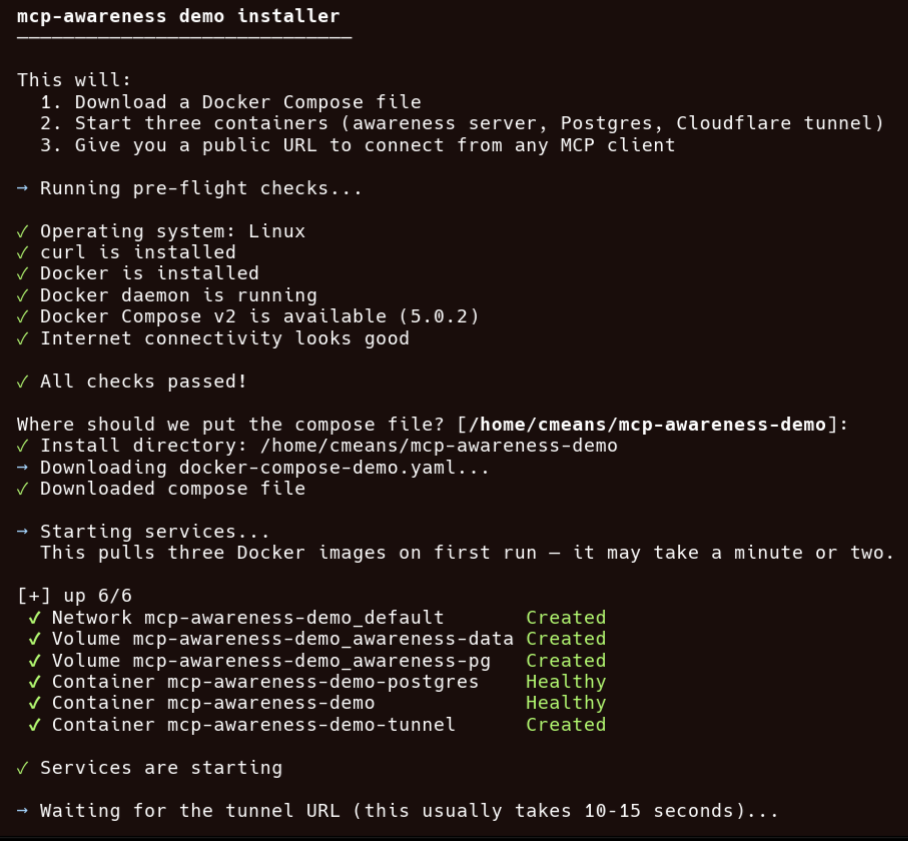
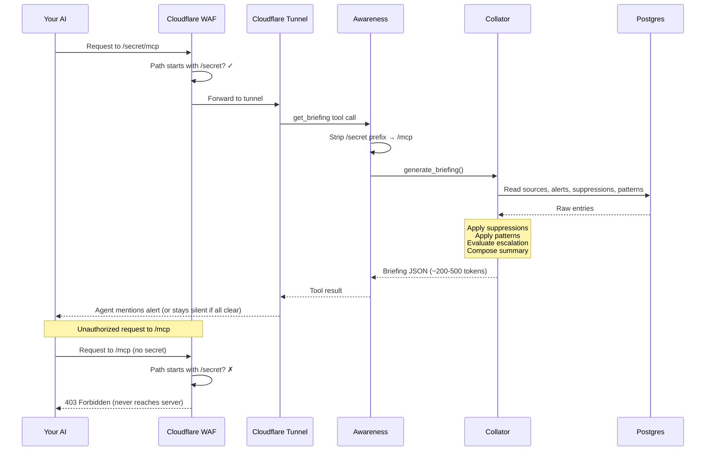

# Deployment Guide

This guide walks through deploying mcp-awareness locally — from starting the server to connecting your AI and seeing ambient awareness in action.

The [secure deployment](#secure-deployment-recommended) section uses a Cloudflare named tunnel and WAF for stable public access, but any reverse proxy that terminates TLS will work (nginx, Caddy, Tailscale, ngrok, etc.). The core requirement is HTTPS between your MCP client and the server.

## Demo install (quickest way to try it)

One script, three containers, a public URL. No Cloudflare account needed.

```bash
curl -sSL https://raw.githubusercontent.com/cmeans/mcp-awareness/main/install-demo.sh | bash
```

> **Prefer to review first?** [View the script on GitHub](https://github.com/cmeans/mcp-awareness/blob/main/install-demo.sh)

This starts the Awareness server, Postgres, and a Cloudflare quick tunnel. You'll get:
- A public URL usable from any MCP client
- Ready-to-paste config snippets for all major MCP clients
- Pre-loaded demo data your AI discovers automatically
- A `getting-started` prompt that interviews you and personalizes the instance

The tunnel URL is ephemeral — it changes on restart. Data persists in Docker named volumes across restarts. To remove everything: `docker compose -f ~/mcp-awareness-demo/docker-compose-demo.yaml down -v`

> **Model matters:** Best experience with Claude Sonnet 4.6 or Opus 4.6. Smaller models (Haiku, GPT-4o-mini) may not follow MCP prompts reliably.

<details>
<summary>Example output (click to expand)</summary>



</details>

When you're ready for a stable URL, continue to the secure deployment section below.

## Prerequisites

> **Platform note:** These instructions were developed on Fedora Linux. Other Linux distributions and macOS should work with minor adjustments. Windows is untested and likely requires WSL or similar.

- Docker and Docker Compose
- [cloudflared](https://github.com/cloudflare/cloudflared/releases) installed
- A [Cloudflare account](https://dash.cloudflare.com/sign-up) with a domain (for named tunnel)
- An MCP-compatible AI client. Best results with capable models like Claude Sonnet 4.6 or Opus 4.6

## Quick start (local only)

If you just want to test locally without public access:

```bash
git clone https://github.com/cmeans/mcp-awareness.git
cd mcp-awareness
docker compose up -d
```

The server is running on port 8420. Use `http://localhost:8420/mcp` as the endpoint in Claude Desktop or Claude Code. Data is stored in `~/awareness/awareness.db` by default.

## Secure deployment (recommended)

This section sets up a publicly accessible deployment with Docker Compose, a stable URL via Cloudflare Tunnel, and basic access control via a secret path + Cloudflare WAF. This is suitable for personal use and testing — not production-grade security.

### Step 1: Set up Cloudflare

1. Create a free [Cloudflare account](https://dash.cloudflare.com/sign-up)
2. Add a domain to your Cloudflare account (any registrar works)
3. Authenticate cloudflared:
   ```bash
   cloudflared tunnel login
   # Opens browser → select your domain → authorize
   ```
4. Create a named tunnel:
   ```bash
   cloudflared tunnel create my-awareness
   # Note the tunnel ID and credentials file path
   ```
5. Add a CNAME DNS record for your domain pointing to the tunnel:
   ```bash
   cloudflared tunnel route dns my-awareness awareness.yourdomain.com
   ```
   If your DNS is managed outside Cloudflare, add a CNAME manually:
   - **Name**: `awareness` (or `@` for root)
   - **Target**: `<tunnel-id>.cfargotunnel.com`

> **Important**: If your domain's nameservers are not on Cloudflare, the `cloudflared tunnel route dns` command will add the CNAME to Cloudflare's DNS, not your provider. You must add the CNAME at your DNS provider manually.

### Step 2: Configure the tunnel

Create `~/.cloudflared/config.yml`:

```yaml
tunnel: <your-tunnel-id>
credentials-file: /etc/cloudflared/credentials.json

ingress:
  - hostname: awareness.yourdomain.com
    service: http://mcp-awareness:8420
  - service: http_status:404
```

### Step 3: Generate a secret path

The secret path prevents unauthorized access to your MCP endpoint. Only requests to `/<secret>/mcp` are served; everything else gets a 404.

```bash
python3 -c "import secrets; print(secrets.token_urlsafe(24))"
# Example output: a1B2c3D4e5F6g7H8i9J0k1L2m3N4o5P6
```

Create a `.env` file in your project directory (**do not commit this file**):

```bash
AWARENESS_MOUNT_PATH=/your-generated-secret-here
```

### Step 4: Start the stack

```bash
docker compose up -d
```

This starts:
- **mcp-awareness** — the Awareness server (HTTP transport, secret path mounted)
- **postgres** — PostgreSQL with pgvector
- **awareness-tunnel** — named Cloudflare Tunnel to your domain

Verify:
```bash
# Should return 404 (blocked — no secret)
curl -s -o /dev/null -w "%{http_code}" https://yourdomain.com/mcp

# Should return 406 (MCP server responding, rejects plain GET)
curl -s -o /dev/null -w "%{http_code}" https://yourdomain.com/<your-secret>/mcp
```

### Step 5: Add Cloudflare WAF rule

The secret path protects at the server level, but without a WAF rule, every request still reaches your machine. Add a WAF rule to block at the edge:

1. Cloudflare dashboard → your domain → **Security** → **Security rules**
2. **Create rule** → **Custom rules**
3. Configure:
   - **Rule name**: `block-without-secret`
   - **Field**: URI Path
   - **Operator**: does not start with
   - **Value**: `/<your-secret>`
   - **Action**: Block
4. **Deploy**

Now unauthorized requests are blocked at Cloudflare's edge — they never reach your tunnel or server.

Verify:
```bash
# Should return 403 (Cloudflare blocks it)
curl -s -o /dev/null -w "%{http_code}" https://yourdomain.com/mcp

# Should return 406 (allowed through to MCP server)
curl -s -o /dev/null -w "%{http_code}" https://yourdomain.com/<your-secret>/mcp
```

### Step 6: Populate the store (optional)

The store starts empty. You can populate it by talking to your AI — just tell it things and it will use the awareness tools to store them. If your client supports MCP prompts, try the `getting-started` prompt to have your AI interview you and store the results.

You can also seed data programmatically for testing:

```python
from mcp_awareness.store import SQLiteStore

store = SQLiteStore("~/awareness/awareness.db")
store.upsert_status("synology-nas", ["infra", "nas", "seedbox"], {
    "metrics": {"cpu": {"usage_pct": 45}, "memory": {"usage_pct": 78}},
    "inventory": {"docker": {"running": ["plex"], "stopped": ["qbittorrent"]}},
    "ttl_sec": 7200,
})
store.upsert_alert("synology-nas", ["infra", "nas", "docker"], "struct-qbt-stopped", {
    "alert_id": "struct-qbt-stopped",
    "level": "warning",
    "alert_type": "structural",
    "message": "qbittorrent container is not running — disk I/O dropped to 12%",
    "resolved": False,
})
```

### Step 7: Connect your AI

Point any MCP client that supports streamable HTTP at your endpoint:

```
https://yourdomain.com/<your-secret>/mcp
```

**Claude.ai**: Settings → Connectors → Add custom connector. Name it `awareness` — Claude uses the connector name as context when deciding which tools to call. Paste the URL.

**Claude Desktop / Claude Code**: add to MCP settings:
```json
{
  "mcpServers": {
    "awareness": {
      "url": "https://yourdomain.com/<your-secret>/mcp"
    }
  }
}
```

**VS Code**: add to `.vscode/mcp.json`:
```json
{
  "servers": {
    "awareness": {
      "type": "http",
      "url": "https://yourdomain.com/<your-secret>/mcp"
    }
  }
}
```

**Cursor**: add to `.cursor/mcp.json`:
```json
{
  "mcpServers": {
    "awareness": {
      "url": "https://yourdomain.com/<your-secret>/mcp"
    }
  }
}
```

### Step 8: Set up agent instructions

If your client supports MCP prompts, the `agent_instructions` prompt provides your AI with the full awareness workflow automatically. No manual memory setup needed.

For clients without prompt support, ask your AI to retrieve the instructions:

> Check awareness for agent instructions — `get_knowledge(source="awareness-prompt")`

It will retrieve the prompt entries and can add them to its memory.

For platform-specific setup (Claude Code CLAUDE.md, Claude Desktop memory), see [Memory Prompts](memory-prompts.md).

### Step 9: Test it

Start a **new conversation** and ask something unrelated:

> What's the weather like this weekend?

If you populated the store in Step 6, your AI should:
1. Call `get_briefing` (visible in the tool use area)
2. Mention any alerts as an FYI before answering
3. Answer your question normally

If the store is empty, the briefing will return with `attention_needed: false` and your AI will answer normally without mentioning awareness. Try telling it something to store:

> Remember that my home server runs Ubuntu 24.04 with 32GB RAM

Then start a new conversation and ask about your setup — it should retrieve what you stored.

### Step 10: Test suppression

Say:

> I know about the qBittorrent issue, suppress it for now

Claude calls `suppress_alert`. Subsequent new conversations no longer mention it.

### Step 11: Personalize your instance

If your client supports MCP prompts, use the `getting-started` prompt. Your AI will interview you about your setup, projects, and preferences, then store everything in awareness.

If prompts aren't available, tell your AI directly:

> Remember that I'm a developer working on [project]. I use [tools]. I prefer terse communication.

Your AI will use `remember`, `learn_pattern`, and `set_preference` to store tagged, searchable entries. This knowledge is now accessible from any MCP client on any platform.

You can verify what's stored:

> How many entries are in awareness?

> What tags are in use?

## Alternative: Quick tunnel (no account needed)

The easiest way is the [demo installer](#demo-install-quickest-way-to-try-it) at the top of this page. If you prefer to do it manually:

```bash
docker compose --profile quick up -d mcp-awareness tunnel-quick
docker logs awareness-tunnel-quick 2>&1 | grep "trycloudflare.com"
# → https://some-random-words.trycloudflare.com
```

Use `https://some-random-words.trycloudflare.com/mcp` as the connector URL. The URL changes on every restart. No WAF protection — suitable for testing only.

## What's happening under the hood



## Security considerations

**This is important.** The awareness store may contain personal information — infrastructure details, project knowledge, health data, financial context. Securing the endpoint is not optional.

The current approach uses two layers:

1. **Cloudflare WAF** — blocks requests at the edge if the path doesn't match the secret prefix. Unauthorized traffic never reaches your machine. This is the primary defense.

2. **Server middleware** — `SecretPathMiddleware` strips the secret prefix and routes to `/mcp`. Requests without the prefix get 404. This is the fallback defense if Cloudflare is bypassed.

**What this does NOT protect against:**
- Someone who obtains your secret URL has full read/write access
- The secret is transmitted in the URL path (visible in server logs, Cloudflare logs)
- No per-user authentication — anyone with the URL is "you"

**For production / multi-user use**, implement proper authentication:
- OAuth 2.0 with token validation
- API keys in headers (requires MCP client support)
- Cloudflare Access with compatible identity providers

**Known client/platform gotchas:**
- Claude.ai custom connectors support OAuth Client ID / Secret fields, but these follow standard OAuth flows — they are **not compatible** with Cloudflare Access service tokens (which use `CF-Access-Client-Id` / `CF-Access-Client-Secret` headers)
- Cloudflare Managed OAuth requires dynamic client registration (RFC 8707), which Claude.ai does not support
- cloudflared tunnel ingress rules cannot rewrite URL paths — the server must handle path rewriting
- FastMCP's `mount_path` parameter only works for SSE transport, not streamable-http — this is why we use custom `SecretPathMiddleware` instead of the built-in option

## Notes

- **The store persists** in the data directory. Restart the server and your data is still there.
- **Not all clients support all MCP features** — the MCP spec defines [resources](https://modelcontextprotocol.io/docs/concepts/resources), [tools](https://modelcontextprotocol.io/docs/concepts/tools), and [prompts](https://modelcontextprotocol.io/docs/concepts/prompts). Client support varies: some only surface tools (e.g., Claude.ai), some don't support prompts. All 18 tools work everywhere. Read tools mirror the resources so tools-only clients get full functionality. Prompts (including user-defined custom prompts) are available in clients that support them — VS Code, Claude Desktop, Cursor.

- **18 tools, 5 prompts, user-defined prompts** — tools include `remember` (general notes), `learn_pattern` (operational knowledge), `add_context` (time-limited), `update_entry` (in-place updates with changelog), `get_stats` (store summary), `get_tags` (tag discovery), plus alerting and data management. Built-in prompts: `agent_instructions`, `project_context`, `system_status`, `write_guide`, `catchup`. Store entries with `source="custom-prompt"` to create your own. See the [README](../README.md#tools) for the full list.
- **Model matters** — best experience with Claude Sonnet 4.6 or Opus 4.6. Smaller models (Haiku, GPT-4o-mini) may not follow MCP prompts or call tools proactively.
- **Suppression matching is content-aware** — a suppression tagged `["qbittorrent"]` will match alerts whose alert_id or message contains "qbittorrent", even if the alert's structural tags differ.
- **Soft delete is safe** — `delete_entry` moves entries to trash (30-day retention). Bulk deletes show a dry-run count first and require `confirm=True`. Delete and restore by tags with AND logic (e.g., `delete_entry(tags=["demo"], confirm=True)` deletes entries matching all given tags). Use `get_deleted` and `restore_entry` to recover.

---

*[mcp-awareness](https://github.com/cmeans/mcp-awareness) is open source under the [Apache 2.0 License](../LICENSE). Copyright 2026 Chris Means.*
