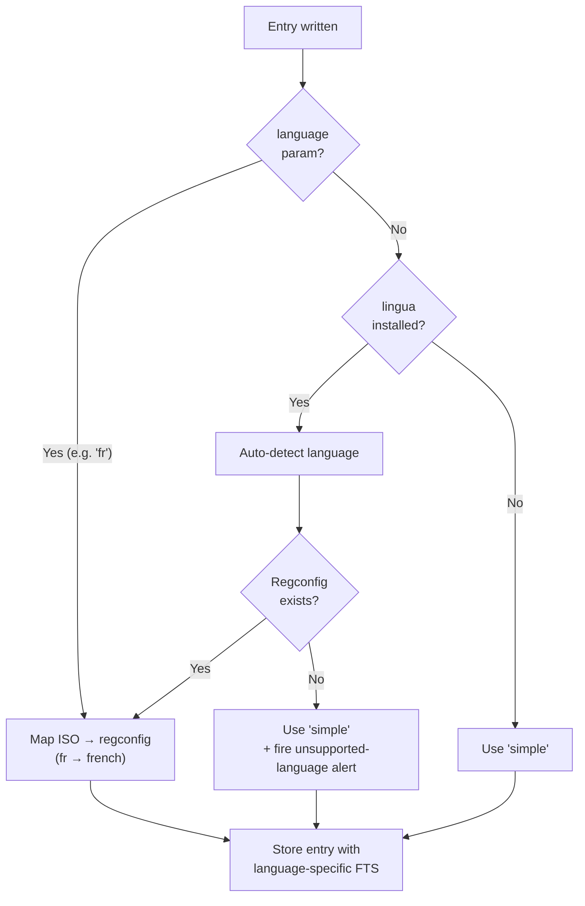
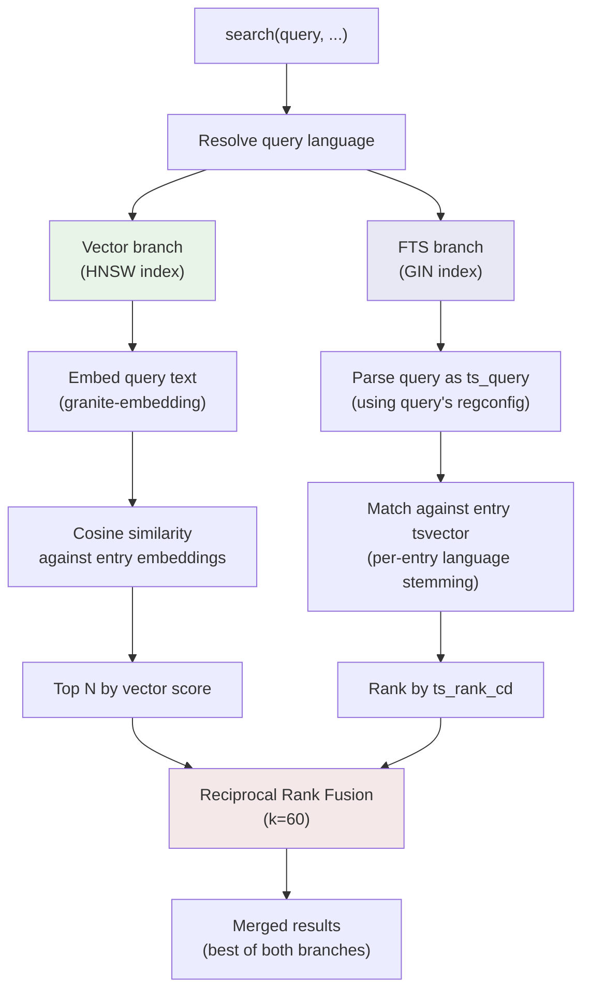

<!-- SPDX-License-Identifier: AGPL-3.0-or-later | Copyright (C) 2026 Chris Means -->
# Language support guide

New in v0.17.0. This guide explains how mcp-awareness handles
multilingual content — per-entry language detection, language-specific
full-text search, and vector search across languages.

## Contents

### Adding and maintaining data
- [How it works](#how-it-works) — the language resolution chain
- [Supported FTS languages](#supported-fts-languages) — 28 Postgres regconfigs
- [Embedding model languages](#embedding-model-languages) — 12 natively trained + ~100 via XLM-RoBERTa
- [Writing in a specific language](#writing-in-a-specific-language) — explicit, auto-detected, override
- [Unsupported-language alerts](#unsupported-language-alerts) — demand signals for new languages

### Searching and retrieving data
- [Querying by language](#querying-by-language) — filter by language
- [Hybrid search across languages](#hybrid-search-across-languages) — how vector + FTS work together

### Operations
- [Deployment notes](#deployment-notes) — lingua install, backfill, regconfig cache
- [What's next](#whats-next) — Phases 2–3, data sovereignty
- [Reference and credits](#reference-and-credits) — upstream projects we depend on

---

## How it works



Every entry has a `language` column that stores a Postgres
[regconfig](https://www.postgresql.org/docs/17/textsearch-configuration.html)
name (e.g., `english`, `french`, `german`). This regconfig controls
how full-text search (FTS) tokenizes and stems that entry's text.

The language is resolved at write time through this chain:

1. **Explicit parameter.** Write tools (`remember`, `add_context`,
   `learn_pattern`, `remind`, `register_schema`, `create_record`)
   accept an optional `language` parameter. Pass an ISO 639-1 code
   (e.g., `"fr"` for French) to force a specific language.

2. **Auto-detection.** If no language is provided,
   [lingua-py](https://github.com/pemistahl/lingua-py) analyzes the
   entry's text (description + content) and returns an ISO code. That
   code is mapped to a Postgres regconfig.

3. **Fallback.** If lingua is not installed, or the text is too short
   for reliable detection, or lingua detects a language without a
   Postgres regconfig, the entry is stored with `simple` — a
   language-agnostic config that tokenizes on whitespace without
   stemming.

This means entries are always searchable via FTS. The question is
whether they get language-specific stemming (better recall for
inflected forms) or the `simple` fallback (exact-token matching only).

---

## Supported FTS languages

28 languages have a Postgres snowball regconfig mapped in
mcp-awareness. These get **language-specific stemming** in full-text
search — inflected forms like "serveurs" match "serveur":

| ISO code | Regconfig | | ISO code | Regconfig |
|----------|------------|-|----------|-----------|
| `ar` | arabic | | `it` | italian |
| `ca` | catalan | | `lt` | lithuanian |
| `da` | danish | | `ne` | nepali |
| `de` | german | | `nl` | dutch |
| `el` | greek | | `no` | norwegian |
| `en` | english | | `pt` | portuguese |
| `es` | spanish | | `ro` | romanian |
| `eu` | basque | | `ru` | russian |
| `fi` | finnish | | `sr` | serbian |
| `fr` | french | | `sv` | swedish |
| `ga` | irish | | `ta` | tamil |
| `hi` | hindi | | `tr` | turkish |
| `hu` | hungarian | | `yi` | yiddish |
| `hy` | armenian | | | |
| `id` | indonesian | | | |

Languages not in this list (e.g., Chinese, Japanese, Korean, Hebrew)
fall back to `simple` for FTS. Phase 3 of the hybrid retrieval design
covers non-Western FTS support via Postgres extensions (`pgroonga`,
`zhparser`, etc.), but that hasn't shipped yet.

---

## Embedding model languages

The default embedding model is
[granite-embedding:278m-multilingual](https://huggingface.co/ibm-granite/granite-embedding-278m-multilingual),
from the [IBM Granite](https://www.ibm.com/granite) family
([paper](https://arxiv.org/html/2502.20204v1)), served locally via
[Ollama](https://ollama.com/library/granite-embedding). We chose it
because it is open-weight, enterprise-licensed, produces 768-dim
vectors that fit our HNSW index, and runs well on modest hardware.
If you're using the default configuration, you're using this model;
see the [embedding provider docs](deployment-guide.md#embedding-provider)
for alternatives.

### Natively trained (12 languages)

The Granite team fine-tuned the model on retrieval pairs in 12
languages. These get the strongest embedding quality:

- Arabic
- Chinese
- Czech
- Dutch
- English
- French
- German
- Italian
- Japanese
- Korean
- Portuguese
- Spanish

### Inherited from XLM-RoBERTa (~100 languages)

Granite's embedding model is built on top of
[XLM-RoBERTa](https://huggingface.co/FacebookAI/xlm-roberta-base)
([paper](https://arxiv.org/pdf/1911.02116), from Meta AI's
[FAIR team](https://ai.meta.com/research/)), which was pre-trained
on 2.5 TB of Common Crawl data covering ~100 languages. Languages
outside the 12 fine-tuned set still produce usable embeddings — recall
is lower than for trained languages but usable for cross-lingual
retrieval.

<details>
<summary><strong>Full list of ~100 XLM-RoBERTa languages</strong></summary>

Afrikaans, Albanian, Amharic, Arabic, Armenian, Assamese, Azerbaijani,
Basque, Belarusian, Bengali, Bengali (Romanized), Bosnian, Breton,
Bulgarian, Burmese, Burmese (zawgyi font), Catalan, Chinese
(Simplified), Chinese (Traditional), Croatian, Czech, Danish, Dutch,
English, Esperanto, Estonian, Filipino, Finnish, French, Galician,
Georgian, German, Greek, Gujarati, Hausa, Hebrew, Hindi, Hindi
(Romanized), Hungarian, Icelandic, Indonesian, Irish, Italian,
Japanese, Javanese, Kannada, Kazakh, Khmer, Korean, Kurdish
(Kurmanji), Kyrgyz, Lao, Latin, Latvian, Lithuanian, Macedonian,
Malagasy, Malay, Malayalam, Marathi, Mongolian, Nepali, Norwegian,
Oriya, Oromo, Pashto, Persian, Polish, Portuguese, Punjabi, Romanian,
Russian, Sanskrit, Scottish Gaelic, Serbian, Sindhi, Sinhala, Slovak,
Slovenian, Somali, Spanish, Sundanese, Swahili, Swedish, Tamil, Tamil
(Romanized), Telugu, Telugu (Romanized), Thai, Turkish, Ukrainian,
Urdu, Urdu (Romanized), Uyghur, Uzbek, Vietnamese, Welsh, Western
Frisian, Xhosa, Yiddish.

Source: [fairseq XLM-R docs](https://github.com/facebookresearch/fairseq/tree/main/examples/xlmr).

</details>

### Why this matters even without FTS stemming

Languages like Japanese, Korean, and Chinese have no Postgres
regconfig in our mapping — FTS falls back to `simple` (whitespace
tokenization, no stemming). But the embedding model *was* trained on
these languages, so the **vector branch of hybrid search still works
well for them**. A Japanese query will find Japanese entries via
vector similarity even though FTS can't stem the text. This is why
enabling the embedding provider is especially valuable for
multilingual use.

### Coverage summary

| Language category | FTS stemming | Vector search |
|------------------|:---:|:---:|
| 28 mapped FTS languages (e.g., English, French, German) | ✓ | ✓ |
| In Granite's 12 fine-tuned languages, no FTS regconfig (Chinese, Japanese, Korean, Czech) | ✗ (simple fallback) | ✓ (strong) |
| Other XLM-RoBERTa languages (e.g., Swahili, Thai, Vietnamese) | ✗ (simple fallback) | ✓ (partial) |
| Languages outside XLM-RoBERTa vocabulary | ✗ (simple fallback) | ✗ |

---

## Writing in a specific language

### Explicit language

Two reasonable ways this gets used in practice:

**A primarily English-speaking user who also writes in another language** — for example, you own a property in France and keep notes about it in French:

```
remember(
    description="Le serveur NAS est dans le placard du sous-sol.",
    source="personal",
    tags=["infra", "nas"],
    language="fr"
)
```

**A primarily French-speaking user keeping their own notes in French** — in this case it's natural to also use French-language values for `source` and `tags`, since they're just labels you'll search by later:

```
remember(
    description="Le serveur NAS est dans le placard du sous-sol.",
    source="personnel",
    tags=["infrastructure", "nas", "maison"],
    language="fr"
)
```

In both cases the entry is stored with `language = 'french'`. FTS
will stem French inflections correctly — a search for "serveurs" will
match "serveur". Symmetrically, a French-speaking user can keep
entries in English (or any other supported language) whenever that's
more convenient — `language="en"` would store the same content with
English stemming.

> Note: the MCP tool names and parameters themselves (`remember`,
> `description`, etc.) are currently English-only. A future
> localization pass for tool metadata is out of scope — the values
> you write are free to be in any language the model supports.

### Auto-detected language

If you don't pass `language`, lingua-py is used to auto-detect:

```
remember(
    description="Der NAS-Server steht im Kellerschrank.",
    source="personal",
    tags=["infra", "nas"]
)
```

With lingua installed, this auto-detects as German (`de`) → stored
as `german` regconfig. Without lingua, it falls back to `simple`.

### Override on update

```
update_entry(
    entry_id="<entry-id>",
    language="de"
)
```

If auto-detection guessed wrong (or the entry was written before
lingua was installed), you can update the language explicitly.

---

## Unsupported-language alerts

When you write an entry and lingua detects a language that has no
Postgres regconfig (e.g., Chinese, Japanese, Korean), mcp-awareness:

1. Stores the entry with `language = 'simple'` (FTS still works,
   just without stemming; vector search still works if the language
   is in the embedding model's training set).
2. Fires an **info-level structural alert** with the tag
   `unsupported-language-{iso}` (e.g., `unsupported-language-zh`).

These alerts are upserted per language — you'll see at most one
alert per unsupported language, not one per entry. They serve as a
demand signal: if `unsupported-language-ja` fires, the operator
knows users are writing in Japanese and should consider installing
Phase 3 language support when it ships.

You can find current unsupported-language alerts via:

```
search(query="unsupported language", entry_type="alert")
```

Or browse all active alerts with `get_alerts()` and look for alert IDs
starting with `unsupported-language-`.

---

## Querying by language

### Filter `get_knowledge` to a single language

```
get_knowledge(tags=["infra"], language="fr")
```

Returns only French-language entries matching the tag filter. The
`language` parameter accepts an ISO 639-1 code (`"fr"`) or the
special value `"simple"` (entries with no detected language).

---

## Hybrid search across languages



```
search(query="NAS server basement", tags=["infra"])
```

The `search` tool runs two branches in parallel:

- **Vector branch** (green above) — if an embedding provider is
  configured, embeds the query and compares it against stored entry
  embeddings via cosine similarity. This is **language-agnostic** —
  the multilingual embedding model handles cross-lingual matching
  internally. A French query can find English entries and vice versa.
- **FTS branch** (blue above) — parses the query as a Postgres
  `ts_query` using the query's resolved language for stemming, then
  matches against entries' `tsv` column (which uses each entry's own
  language for stemming). This is **language-specific** — French
  stemming matches French entries, English matches English.

Results from both branches are fused via **Reciprocal Rank Fusion**
(red above, k=60). RRF doesn't care about absolute scores — it
combines rankings, so an entry that ranks highly in *either* branch
surfaces in the final results.

### What this means in practice

| Scenario | Vector branch | FTS branch | Result |
|----------|:---:|:---:|--------|
| Same-language query (e.g., English → English) | ✓ strong | ✓ strong | Best recall — both branches contribute |
| Cross-language query (e.g., French → English) | ✓ strong | ✗ miss | Vector carries the match; still works |
| Rare identifier or exact term | ✗ weak | ✓ strong | FTS rescues the match |
| Long document (>500 chars) | ✗ partial (first 500 chars embedded) | ✓ full text indexed | FTS rescues buried terms |
| No embedding provider configured | ✗ skipped | ✓ only branch | FTS-only mode, still functional |

**Graceful degradation:** if no embedding provider is configured,
search runs FTS only. If an entry has no embedding (new entry,
backfill not yet run), it still participates in FTS. If the query
text is too short for meaningful FTS (stop words only), the vector
branch carries. Each branch compensates for the other's gaps.

---

## Deployment notes

### Installing lingua

lingua-py is an optional dependency. Without it, all entries get
`language = 'simple'` (still searchable, just without stemming).

```bash
pip install lingua-language-detector
```

Or, if using the Docker image, lingua is included by default.

### Language backfill on upgrade

When upgrading to v0.17.0+, two Alembic migrations run:

1. **Schema migration** — adds `language` and `tsv` columns (fast,
   DDL only).
2. **Language backfill** — runs lingua detection on all existing
   entries and updates the `language` column. This is a one-time data
   migration:
   - lingua's first call loads ~300 MB of n-gram models (multi-second
     startup cost)
   - Each existing entry is processed for language detection
   - If lingua is not installed, the backfill is skipped and entries
     remain as `simple`

After backfill, existing entries participate in language-specific FTS
immediately — no re-indexing needed (the `tsv` column is a generated
column that updates automatically when `language` changes).

### Regconfig validation

At startup, `PostgresStore` caches valid Postgres regconfig names from
`pg_ts_config`. If a write provides a regconfig that doesn't exist in
the server's Postgres (e.g., a third-party config was uninstalled),
the entry falls back to `simple` with a one-time cache refresh. This
prevents INSERT failures from invalid `language` values reaching the
generated `tsv` column.

---

## What's next

- **Phase 2: Cross-lingual vector model** — swap the embedding model
  to one with stronger cross-lingual properties (e.g., multilingual-e5
  or similar). Tracked at
  [#239](https://github.com/cmeans/mcp-awareness/issues/239).
- **Phase 3: Non-Western language support** — install Postgres
  extensions for CJK, Hebrew, and other languages that need
  non-snowball tokenizers. Driven by unsupported-language alerts.
- **Data sovereignty framework** — governs where content is sent for
  inference, required before cloud embedding providers ship as
  defaults.

---

## Reference and credits

Multilingual support in mcp-awareness stands on the shoulders of a
number of open-source and open-weight projects. Credit where credit
is due:

### Projects we depend on

- **[IBM Granite](https://www.ibm.com/granite)** — the Granite
  Embedding team trained the 278m multilingual model we use by
  default. Released under an Apache-2.0 license on
  [Hugging Face](https://huggingface.co/ibm-granite/granite-embedding-278m-multilingual),
  with a
  [detailed model paper](https://arxiv.org/html/2502.20204v1).
- **[Meta AI (FAIR team)](https://ai.meta.com/research/)** — authors
  of [XLM-RoBERTa](https://huggingface.co/FacebookAI/xlm-roberta-base)
  (Conneau et al.,
  [*Unsupervised Cross-lingual Representation Learning at Scale*](https://arxiv.org/pdf/1911.02116)),
  the multilingual transformer backbone that makes Granite's ~100-
  language coverage possible. Trained on the CC-100 corpus they also
  curated.
- **[Ollama](https://ollama.com)** — makes it trivial to run embedding
  models locally. We pull `granite-embedding:278m` from
  [ollama.com/library/granite-embedding](https://ollama.com/library/granite-embedding).
- **[lingua-py](https://github.com/pemistahl/lingua-py)** (Peter
  M. Stahl) — the language detection library that powers
  auto-detection. Fast, accurate, works offline, supports 75+
  languages.
- **[Hugging Face](https://huggingface.co)** — hosts the model
  weights, model cards, and community around both Granite and
  XLM-RoBERTa.
- **[PostgreSQL](https://www.postgresql.org)** — the
  [text search infrastructure](https://www.postgresql.org/docs/17/textsearch-configuration.html)
  (regconfigs, tsvector, ts_rank_cd) we lean on for FTS.
- **[pgvector](https://github.com/pgvector/pgvector)** (Andrew
  Kane) — the Postgres extension that gives us HNSW-indexed vector
  search alongside everything else in the same database.
- **[Snowball](https://snowballstem.org)** (Martin Porter et al.) —
  the stemmers behind the 28 FTS regconfigs listed above, most of
  which ship with Postgres by default.

### Internal references

- [Hybrid Retrieval + Multilingual design](design/hybrid-retrieval-multilingual.md)
  — full design doc covering Layers 1–3, data sovereignty, and the
  dilution-bug root cause.
- [Data Dictionary](data-dictionary.md) — `language` and `tsv`
  column definitions.

---

Part of the [ Awareness](https://github.com/cmeans/mcp-awareness) ecosystem. © 2026 Chris Means
