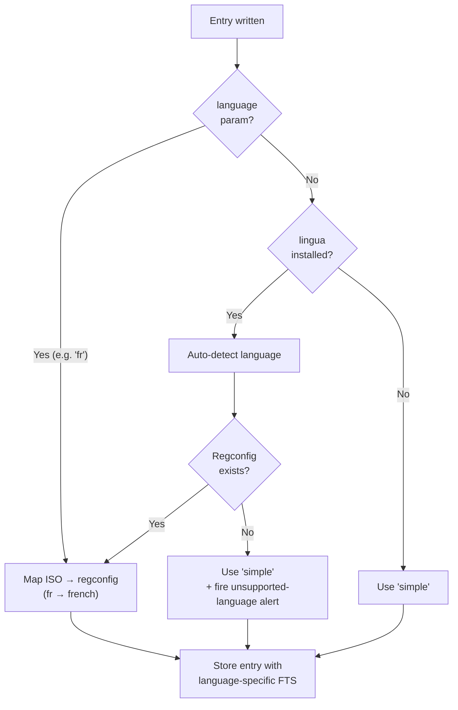
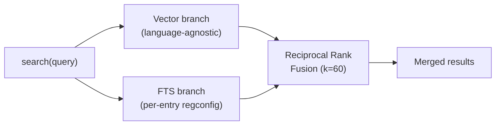

<!-- SPDX-License-Identifier: AGPL-3.0-or-later | Copyright (C) 2026 Chris Means -->
# Language support guide

New in v0.17.0. This guide explains how mcp-awareness handles
multilingual content — per-entry language detection, language-specific
full-text search, and what happens when you write in a language the
server doesn't yet have a Postgres regconfig for.

- Design context:
  [Hybrid Retrieval + Multilingual](design/hybrid-retrieval-multilingual.md).
- Data Dictionary: the `language` column is documented in the
  [common envelope](data-dictionary.md).

---

## How it works



Every entry has a `language` column that stores a Postgres
[regconfig](https://www.postgresql.org/docs/17/textsearch-configuration.html)
name (e.g., `english`, `french`, `german`). This regconfig controls
how full-text search (FTS) tokenizes and stems that entry's text.

The language is resolved at write time through this chain:

1. **Explicit parameter.** Write tools (`remember`, `add_context`,
   `learn_pattern`, `remind`, `register_schema`, `create_record`)
   accept an optional `language` parameter. Pass an ISO 639-1 code
   (e.g., `"fr"` for French) to force a specific language.

2. **Auto-detection.** If no language is provided,
   [lingua-py](https://github.com/pemistahl/lingua-py) analyzes the
   entry's text (description + content) and returns an ISO code. That
   code is mapped to a Postgres regconfig.

3. **Fallback.** If lingua is not installed, or the text is too short
   for reliable detection, or lingua detects a language without a
   Postgres regconfig, the entry is stored with `simple` — a
   language-agnostic config that tokenizes on whitespace without
   stemming.

This means entries are always searchable via FTS. The question is
whether they get language-specific stemming (better recall for
inflected forms) or the `simple` fallback (exact-token matching only).

---

## Supported languages

28 languages have a Postgres snowball regconfig mapped in
mcp-awareness:

| ISO code | Regconfig | | ISO code | Regconfig |
|----------|------------|-|----------|-----------|
| `ar` | arabic | | `it` | italian |
| `ca` | catalan | | `lt` | lithuanian |
| `da` | danish | | `ne` | nepali |
| `de` | german | | `nl` | dutch |
| `el` | greek | | `no` | norwegian |
| `en` | english | | `pt` | portuguese |
| `es` | spanish | | `ro` | romanian |
| `eu` | basque | | `ru` | russian |
| `fi` | finnish | | `sr` | serbian |
| `fr` | french | | `sv` | swedish |
| `ga` | irish | | `ta` | tamil |
| `hi` | hindi | | `tr` | turkish |
| `hu` | hungarian | | `yi` | yiddish |
| `hy` | armenian | | | |
| `id` | indonesian | | | |

Languages not in this list (e.g., Chinese, Japanese, Korean, Hebrew)
fall back to `simple`. Phase 3 of the hybrid retrieval design covers
non-Western language support via Postgres extensions (`pgroonga`,
`zhparser`, etc.), but that hasn't shipped yet.

---

## Writing in a specific language

### Explicit language

```
remember(
    description="Le serveur NAS est dans le placard du sous-sol.",
    source="personal",
    tags=["infra", "nas"],
    language="fr"
)
```

The entry is stored with `language = 'french'`. FTS will stem
French inflections correctly — a search for "serveurs" will match
"serveur".

### Auto-detected language

```
remember(
    description="Der NAS-Server steht im Kellerschrank.",
    source="personal",
    tags=["infra", "nas"]
)
```

With lingua installed, this auto-detects as German (`de`) → stored
as `german` regconfig. Without lingua, it falls back to `simple`.

### Override on update

```
update_entry(
    id="<entry-id>",
    language="de"
)
```

If auto-detection guessed wrong (or the entry was written before
lingua was installed), you can update the language explicitly.

---

## Querying by language

### Filter `get_knowledge` to a single language

```
get_knowledge(tags=["infra"], language="fr")
```

Returns only French-language entries matching the tag filter. The
`language` parameter accepts an ISO 639-1 code (`"fr"`) or the
special value `"simple"` (entries with no detected language).

### Hybrid search across languages



```
search(query="NAS server basement", tags=["infra"])
```

The `search` tool runs two branches:

- **Vector branch** — if an embedding provider is configured,
  compares the query's embedding against entry embeddings. This is
  language-agnostic (the embedding model handles cross-lingual
  similarity internally).
- **FTS branch** — runs a Postgres `ts_query` against the
  `tsv` column, using the *query's* resolved language for
  stemming. This means a French query stems French terms, matching
  entries stored with `language = 'french'`.

Results from both branches are fused via Reciprocal Rank Fusion
(RRF, k=60). In practice:

- Same-language queries get strong matches from both branches.
- Cross-language queries rely more heavily on the vector branch
  (embedding similarity crosses language barriers; FTS stemming
  doesn't). This is why the embedding provider matters most for
  multilingual use — FTS alone only finds same-language matches.

---

## Unsupported-language alerts

When you write an entry and lingua detects a language that has no
Postgres regconfig (e.g., Chinese, Japanese, Korean), mcp-awareness:

1. Stores the entry with `language = 'simple'` (FTS still works,
   just without stemming).
2. Fires an **info-level structural alert** with the tag
   `unsupported-language-{iso}` (e.g., `unsupported-language-zh`).

These alerts are upserted per language — you'll see at most one
alert per unsupported language, not one per entry. They serve as a
demand signal: if `unsupported-language-ja` fires, the operator
knows users are writing in Japanese and should consider installing
Phase 3 language support when it ships.

You can find current unsupported-language alerts via:

```
search(query="unsupported language", entry_type="alert")
```

Or browse all active alerts with `get_alerts()` and look for alert IDs
starting with `unsupported-language-`.

---

## Deployment notes

### Installing lingua

lingua-py is an optional dependency. Without it, all entries get
`language = 'simple'` (still searchable, just without stemming).

```bash
pip install lingua-language-detector
```

Or, if using the Docker image, lingua is included by default.

### Language backfill on upgrade

When upgrading to v0.17.0+, two Alembic migrations run:

1. **Schema migration** — adds `language` and `tsv` columns (fast,
   DDL only).
2. **Language backfill** — runs lingua detection on all existing
   entries and updates the `language` column. This is a one-time data
   migration:
   - lingua's first call loads ~300 MB of n-gram models (multi-second
     startup cost)
   - Each existing entry is processed for language detection
   - If lingua is not installed, the backfill is skipped and entries
     remain as `simple`

After backfill, existing entries participate in language-specific FTS
immediately — no re-indexing needed (the `tsv` column is a generated
column that updates automatically when `language` changes).

### Regconfig validation

At startup, `PostgresStore` caches valid Postgres regconfig names from
`pg_ts_config`. If a write provides a regconfig that doesn't exist in
the server's Postgres (e.g., a third-party config was uninstalled),
the entry falls back to `simple` with a one-time cache refresh. This
prevents INSERT failures from invalid `language` values reaching the
generated `tsv` column.

---

## What's next

- **Phase 2: Cross-lingual vector model** — swap the embedding model
  to one with strong cross-lingual properties (e.g., multilingual-e5
  or similar). Tracked at
  [#239](https://github.com/cmeans/mcp-awareness/issues/239).
- **Phase 3: Non-Western language support** — install Postgres
  extensions for CJK, Hebrew, and other languages that need
  non-snowball tokenizers. Driven by unsupported-language alerts.
- **Data sovereignty framework** — governs where content is sent for
  inference, required before cloud embedding providers ship as
  defaults.

---

## Reference

- [Hybrid Retrieval + Multilingual design](design/hybrid-retrieval-multilingual.md)
  — full design doc covering Layers 1–3, data sovereignty, and the
  dilution-bug root cause.
- [Data Dictionary](data-dictionary.md) — `language` and `tsv`
  column definitions.
- [Postgres text search configs](https://www.postgresql.org/docs/17/textsearch-configuration.html)
  — how regconfigs work.
- [lingua-py](https://github.com/pemistahl/lingua-py) — the
  language detection library.
