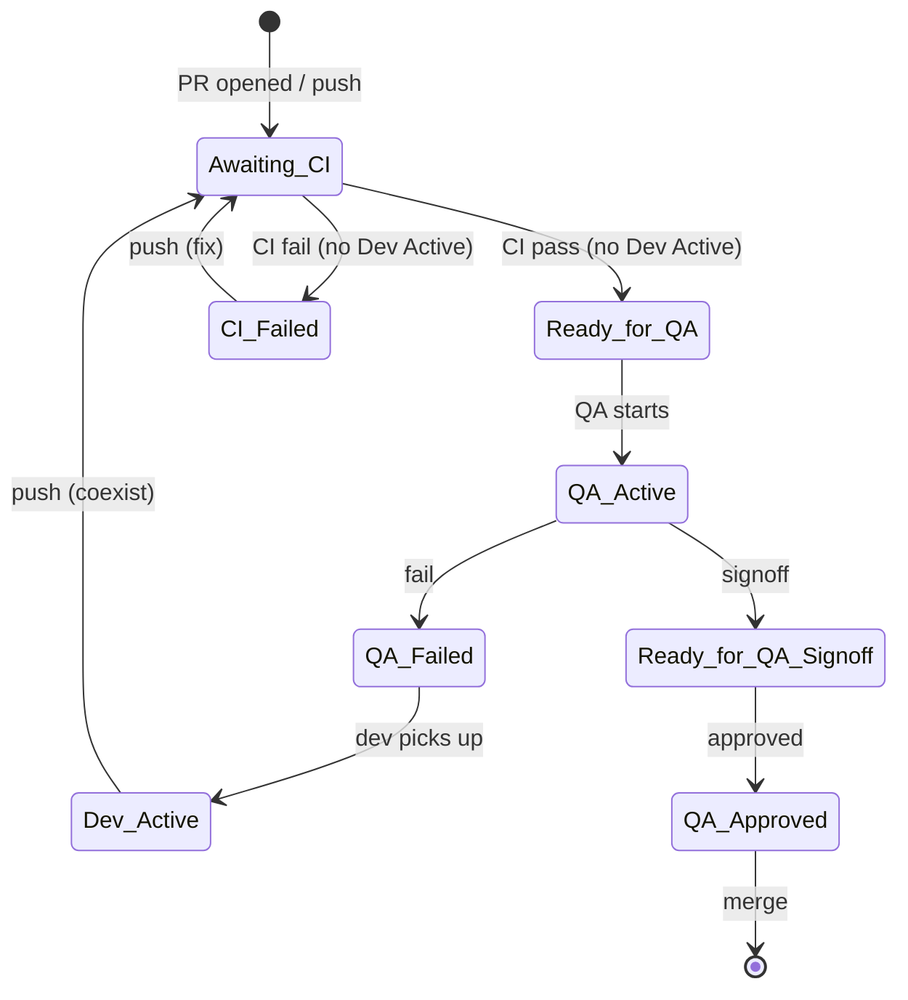

<!-- SPDX-License-Identifier: AGPL-3.0-or-later | Copyright (C) 2026 Chris Means -->
# PR Label State Machine Implementation Plan

> **For agentic workers:** REQUIRED SUB-SKILL: Use superpowers:subagent-driven-development (recommended) or superpowers:executing-plans to implement this plan task-by-task. Steps use checkbox (`- [ ]`) syntax for tracking.

**Goal:** Rewrite the PR label automation as a clean state machine with proper transitions, replacing the current buggy incremental code on the `fix/pr-labels-workflow-split` branch.

**Architecture:** Two workflow files split by trigger type: `pr-labels.yml` (pull_request events) and `pr-labels-ci.yml` (workflow_run events). A shared PR-lookup pattern in the CI file handles 404s safely. Label cleanup rules in on-label provide defense-in-depth for every transition.

**Tech Stack:** GitHub Actions YAML, bash shell scripts, `gh` CLI

**Spec:** `docs/superpowers/specs/2026-03-30-pr-label-state-machine-design.md`

**Branch:** `fix/pr-labels-workflow-split` (already exists, will be rewritten)

---

### Task 1: Rewrite pr-labels.yml (pull_request triggers)

**Files:**
- Rewrite: `.github/workflows/pr-labels.yml`

This file handles three jobs triggered by `pull_request` events: `on-push`, `on-unlabel`, and `on-label`.

- [ ] **Step 1: Write the complete pr-labels.yml file**

Replace the entire contents of `.github/workflows/pr-labels.yml` with:

```yaml
# mcp-awareness — ambient system awareness for AI agents
# Copyright (C) 2026 Chris Means
#
# This program is free software: you can redistribute it and/or modify
# it under the terms of the GNU Affero General Public License as published by
# the Free Software Foundation, either version 3 of the License, or
# (at your option) any later version.
#
# This program is distributed in the hope that it will be useful,
# but WITHOUT ANY WARRANTY; without even the implied warranty of
# MERCHANTABILITY or FITNESS FOR A PARTICULAR PURPOSE.  See the
# GNU Affero General Public License for more details.
#
# You should have received a copy of the GNU Affero General Public License
# along with this program.  If not, see <https://www.gnu.org/licenses/>.

name: PR Label Automation

# Handles label transitions triggered by PR events (push, label, unlabel).
# CI-completion promotion lives in pr-labels-ci.yml (separate workflow_run trigger).
on:
  pull_request:
    branches: [main]
    types: [opened, synchronize, labeled, unlabeled]

permissions:
  pull-requests: write
  checks: read

jobs:
  # When a PR is opened or new commits are pushed, reset to Awaiting CI.
  # Removes stale QA/workflow labels. Keeps Dev Active if present (coexists
  # with Awaiting CI — dev is still working, CI runs but won't promote).
  on-push:
    if: github.event.action == 'opened' || github.event.action == 'synchronize'
    runs-on: ubuntu-latest
    steps:
      - name: Reset labels on new push
        env:
          GH_TOKEN: ${{ secrets.GITHUB_TOKEN }}
          PR_LABELS: ${{ toJSON(github.event.pull_request.labels.*.name) }}
        run: |
          PR=${{ github.event.pull_request.number }}
          REPO=${{ github.repository }}

          HAD_QA_ACTIVE=false
          if echo "$PR_LABELS" | grep -q '"QA Active"'; then
            HAD_QA_ACTIVE=true
          fi

          # Remove stale workflow labels (coalesced into one API call)
          REMOVE=""
          for LABEL in "Ready for QA" "Ready for QA Signoff" "QA Approved" "QA Active" "QA Failed" "CI Failed"; do
            if echo "$PR_LABELS" | grep -q "\"$LABEL\""; then
              if [ -n "$REMOVE" ]; then
                REMOVE="$REMOVE,$LABEL"
              else
                REMOVE="$LABEL"
              fi
            fi
          done
          if [ -n "$REMOVE" ]; then
            gh pr edit "$PR" --repo "$REPO" --remove-label "$REMOVE"
          fi

          # Add Awaiting CI (unless already present).
          # Dev Active is NOT removed — it coexists with Awaiting CI.
          if ! echo "$PR_LABELS" | grep -q '"Awaiting CI"'; then
            gh pr edit "$PR" --repo "$REPO" --add-label "Awaiting CI"
          fi

          # If QA was actively reviewing, notify via comment
          if [ "$HAD_QA_ACTIVE" = true ]; then
            gh pr comment "$PR" --repo "$REPO" \
              --body "New commits pushed while QA was active. QA review invalidated — resetting to Awaiting CI."
          fi

  # When Dev Active is removed manually, check if CI already passed.
  # If yes, promote straight to Ready for QA. If no, Awaiting CI is
  # already present and on-ci-pass will promote when CI completes.
  on-unlabel:
    if: >-
      github.event.action == 'unlabeled'
      && github.event.label.name == 'Dev Active'
    runs-on: ubuntu-latest
    steps:
      - name: Transition after Dev Active removed
        env:
          GH_TOKEN: ${{ secrets.GITHUB_TOKEN }}
          PR_LABELS: ${{ toJSON(github.event.pull_request.labels.*.name) }}
        run: |
          PR=${{ github.event.pull_request.number }}
          REPO=${{ github.repository }}

          # Check if CI already passed for the head commit
          HEAD_SHA=${{ github.event.pull_request.head.sha }}
          CI_CONCLUSION=$(gh api "repos/$REPO/actions/workflows/ci.yml/runs?head_sha=$HEAD_SHA" \
            --jq '.workflow_runs[0].conclusion // empty' 2>/dev/null) || true

          if [ "$CI_CONCLUSION" = "success" ]; then
            # CI passed — promote to Ready for QA
            REMOVE=""
            if echo "$PR_LABELS" | grep -q '"Awaiting CI"'; then
              REMOVE="Awaiting CI"
            fi
            if echo "$PR_LABELS" | grep -q '"CI Failed"'; then
              REMOVE="${REMOVE:+$REMOVE,}CI Failed"
            fi
            if [ -n "$REMOVE" ]; then
              gh pr edit "$PR" --repo "$REPO" --remove-label "$REMOVE"
            fi
            gh pr edit "$PR" --repo "$REPO" --add-label "Ready for QA"
          else
            # CI hasn't passed — Awaiting CI should already be present
            if ! echo "$PR_LABELS" | grep -q '"Awaiting CI"'; then
              gh pr edit "$PR" --repo "$REPO" --add-label "Awaiting CI"
            fi
          fi

  # When a workflow label is added, clean up labels that no longer apply.
  # Only runs for labels that have cleanup rules.
  on-label:
    if: >-
      github.event.action == 'labeled'
      && contains(fromJSON('["Ready for QA","QA Active","Dev Active","Ready for QA Signoff","QA Failed","QA Approved"]'), github.event.label.name)
    runs-on: ubuntu-latest
    steps:
      - name: Clean up stale labels
        env:
          GH_TOKEN: ${{ secrets.GITHUB_TOKEN }}
          ADDED_LABEL: ${{ github.event.label.name }}
          PR_LABELS: ${{ toJSON(github.event.pull_request.labels.*.name) }}
        run: |
          PR=${{ github.event.pull_request.number }}
          REPO=${{ github.repository }}

          remove_if_present() {
            if echo "$PR_LABELS" | grep -q "\"$1\""; then
              gh pr edit "$PR" --repo "$REPO" --remove-label "$1"
            fi
          }

          case "$ADDED_LABEL" in
            "Ready for QA")
              remove_if_present "Awaiting CI"
              remove_if_present "CI Failed"
              ;;
            "QA Active")
              remove_if_present "Ready for QA"
              ;;
            "Dev Active")
              remove_if_present "QA Failed"
              remove_if_present "CI Failed"
              remove_if_present "Awaiting CI"
              remove_if_present "Ready for QA"
              ;;
            "Ready for QA Signoff")
              remove_if_present "QA Active"
              ;;
            "QA Failed")
              remove_if_present "QA Active"
              ;;
            "QA Approved")
              remove_if_present "Ready for QA Signoff"
              ;;
          esac
```

- [ ] **Step 2: Verify YAML syntax**

Run: `python -c "import yaml; yaml.safe_load(open('.github/workflows/pr-labels.yml'))"`
Expected: No output (valid YAML)

- [ ] **Step 3: Commit**

```bash
git add .github/workflows/pr-labels.yml
git commit -m "refactor: rewrite pr-labels.yml as clean state machine

Complete rewrite based on the state machine spec. Key changes:
- Dev Active coexists with Awaiting CI (no longer blocks it)
- on-push keeps Dev Active, removes all other workflow labels
- on-unlabel checks CI status and promotes if already passed
- on-label cleanup includes Ready for QA removing Awaiting CI + CI Failed
- QA Invalidated label removed entirely (comment is sufficient)
- CI Failed added to cleanup rules for Dev Active and Ready for QA"
```

---

### Task 2: Rewrite pr-labels-ci.yml (workflow_run triggers)

**Files:**
- Rewrite: `.github/workflows/pr-labels-ci.yml`

This file handles two jobs triggered by CI completion: `on-ci-pass` and `on-ci-fail`.

- [ ] **Step 1: Write the complete pr-labels-ci.yml file**

Replace the entire contents of `.github/workflows/pr-labels-ci.yml` with:

```yaml
# mcp-awareness — ambient system awareness for AI agents
# Copyright (C) 2026 Chris Means
#
# This program is free software: you can redistribute it and/or modify
# it under the terms of the GNU Affero General Public License as published by
# the Free Software Foundation, either version 3 of the License, or
# (at your option) any later version.
#
# This program is distributed in the hope that it will be useful,
# but WITHOUT ANY WARRANTY; without even the implied warranty of
# MERCHANTABILITY or FITNESS FOR A PARTICULAR PURPOSE.  See the
# GNU Affero General Public License for more details.
#
# You should have received a copy of the GNU Affero General Public License
# along with this program.  If not, see <https://www.gnu.org/licenses/>.

name: PR Label Automation (CI)

# Handles label transitions when CI completes (pass or fail).
# Split from pr-labels.yml because workflow_run fires on every CI
# completion (including merges to main), which caused noisy failures
# when there was no associated PR.
#
# NOTE: References the CI workflow by name ("CI").
# If the CI workflow in ci.yml is ever renamed, update the name here too.
#
# LIMITATION: workflow_run triggers always run from the default branch
# (main), not the PR branch. Changes to this file cannot be tested
# on a PR — they take effect only after merge.
on:
  workflow_run:
    workflows: [CI]
    types: [completed]

permissions:
  pull-requests: write
  checks: read

jobs:
  # When CI passes on a PR branch, promote from Awaiting CI to Ready for QA.
  # Skips if Dev Active is present (dev isn't done yet).
  on-ci-pass:
    if: >-
      github.event.workflow_run.conclusion == 'success'
      && github.event.workflow_run.event == 'pull_request'
      && github.event.workflow_run.head_branch != github.event.repository.default_branch
    runs-on: ubuntu-latest
    steps:
      - name: Promote to Ready for QA
        env:
          GH_TOKEN: ${{ secrets.GITHUB_TOKEN }}
        run: |
          REPO=${{ github.repository }}

          # Look up the associated PR.
          # The API can 404 after a force-push (orphaned run).
          # Capture output only on success so 404 body doesn't leak into $PR.
          PR=""
          API_OUT=$(gh api "repos/$REPO/actions/runs/${{ github.event.workflow_run.id }}/pull_requests" \
            --jq '.[0].number // empty' 2>&1) && PR="$API_OUT" || true

          # Fallback: pull_requests array is empty for dependabot PRs.
          # Search by head branch instead.
          if [ -z "$PR" ]; then
            HEAD_BRANCH=${{ github.event.workflow_run.head_branch }}
            PR=$(gh pr list --repo "$REPO" --head "$HEAD_BRANCH" --state open \
              --json number --jq '.[0].number // empty' 2>/dev/null) || true
          fi

          if [ -z "$PR" ]; then
            echo "No PR associated with this workflow run — exiting"
            exit 0
          fi

          LABELS=$(gh pr view "$PR" --repo "$REPO" --json labels --jq '.labels[].name')

          # Dev Active means dev isn't done — don't promote.
          # on-unlabel will handle promotion when Dev Active is removed.
          if echo "$LABELS" | grep -q "^Dev Active$"; then
            echo "Dev Active present — skipping promotion"
            exit 0
          fi

          # Promote if Awaiting CI is present
          if echo "$LABELS" | grep -q "^Awaiting CI$"; then
            REMOVE="Awaiting CI"
            if echo "$LABELS" | grep -q "^CI Failed$"; then
              REMOVE="Awaiting CI,CI Failed"
            fi
            gh pr edit "$PR" --repo "$REPO" --remove-label "$REMOVE"
            gh pr edit "$PR" --repo "$REPO" --add-label "Ready for QA"
          fi

  # When CI fails on a PR branch, set CI Failed.
  # Skips if Dev Active is present (dev is already working).
  on-ci-fail:
    if: >-
      github.event.workflow_run.conclusion == 'failure'
      && github.event.workflow_run.event == 'pull_request'
      && github.event.workflow_run.head_branch != github.event.repository.default_branch
    runs-on: ubuntu-latest
    steps:
      - name: Set CI Failed
        env:
          GH_TOKEN: ${{ secrets.GITHUB_TOKEN }}
        run: |
          REPO=${{ github.repository }}

          PR=""
          API_OUT=$(gh api "repos/$REPO/actions/runs/${{ github.event.workflow_run.id }}/pull_requests" \
            --jq '.[0].number // empty' 2>&1) && PR="$API_OUT" || true

          if [ -z "$PR" ]; then
            HEAD_BRANCH=${{ github.event.workflow_run.head_branch }}
            PR=$(gh pr list --repo "$REPO" --head "$HEAD_BRANCH" --state open \
              --json number --jq '.[0].number // empty' 2>/dev/null) || true
          fi

          if [ -z "$PR" ]; then
            echo "No PR associated with this workflow run — exiting"
            exit 0
          fi

          LABELS=$(gh pr view "$PR" --repo "$REPO" --json labels --jq '.labels[].name')

          # Dev Active means dev is already working — don't add CI Failed
          if echo "$LABELS" | grep -q "^Dev Active$"; then
            echo "Dev Active present — skipping CI Failed"
            exit 0
          fi

          # Set CI Failed if Awaiting CI is present (normal flow)
          if echo "$LABELS" | grep -q "^Awaiting CI$"; then
            gh pr edit "$PR" --repo "$REPO" --remove-label "Awaiting CI"
            gh pr edit "$PR" --repo "$REPO" --add-label "CI Failed"
          fi
```

- [ ] **Step 2: Verify YAML syntax**

Run: `python -c "import yaml; yaml.safe_load(open('.github/workflows/pr-labels-ci.yml'))"`
Expected: No output (valid YAML)

- [ ] **Step 3: Commit**

```bash
git add .github/workflows/pr-labels-ci.yml
git commit -m "refactor: rewrite pr-labels-ci.yml with CI Failed state and safe PR lookup

Complete rewrite based on the state machine spec. Key changes:
- on-ci-fail adds CI Failed label (not Dev Active) when CI fails
- Dev Active suppresses both pass and fail transitions
- Safe 404 handling: API output captured only on success
- head_branch filter skips CI runs on main (merge commits)
- CI Failed cleaned up on next CI pass"
```

---

### Task 3: Create CI Failed label and clean up QA Invalidated

**Files:** None (GitHub API only)

- [ ] **Step 1: Create the CI Failed label**

```bash
gh label create "CI Failed" --repo cmeans/mcp-awareness --color "B60205" --description "CI failed — dev needs to fix" --force
```

Expected: Label created (red color matches QA Failed)

- [ ] **Step 2: Delete QA Invalidated label if it exists**

```bash
gh label delete "QA Invalidated" --repo cmeans/mcp-awareness --yes 2>/dev/null || echo "Label does not exist"
```

Expected: Label deleted or "does not exist"

- [ ] **Step 3: Verify label set**

```bash
gh label list --repo cmeans/mcp-awareness | grep -E "Active|Awaiting|Failed|Ready|QA|CI"
```

Expected: Shows `Dev Active`, `Awaiting CI`, `CI Failed`, `Ready for QA`, `QA Active`, `Ready for QA Signoff`, `QA Failed`, `QA Approved`. No `QA Invalidated`.

- [ ] **Step 4: Commit** (no file changes — label operations are API-only, but commit the spec)

```bash
git add docs/superpowers/specs/2026-03-30-pr-label-state-machine-design.md
git commit -m "docs: add PR label state machine design spec"
```

---

### Task 4: Update PR description and push

- [ ] **Step 1: Update the PR #108 description to reflect the full redesign**

```bash
gh pr edit 108 --title "refactor: PR label automation as a proper state machine" --body "$(cat <<'PREOF'
## Summary

- Rewrites the PR label automation as a clean state machine with defined states, transitions, and cleanup rules
- Splits workflow_run trigger into separate file to eliminate failure emails on merges to main
- Adds `CI Failed` label for CI failures (covers both hard failures and Codecov)
- Removes `QA Invalidated` label (push comment is sufficient)
- `Dev Active` now coexists with `Awaiting CI` instead of blocking it

## State Machine



## Design spec

`docs/superpowers/specs/2026-03-30-pr-label-state-machine-design.md`

## Changes

| File | What |
|------|------|
| `pr-labels.yml` | Rewritten: on-push keeps Dev Active, removes all others, adds Awaiting CI. on-unlabel promotes if CI passed. on-label has full cleanup matrix. |
| `pr-labels-ci.yml` | Rewritten: on-ci-pass promotes (skips if Dev Active). on-ci-fail adds CI Failed (skips if Dev Active). Safe 404 handling. |
| Labels | Created `CI Failed`. Deleted `QA Invalidated`. |

## QA

### Prerequisites
- Review both workflow files against the spec

### Manual tests
1. - [ ] **New PR without Dev Active** — create a test PR, verify it gets `Awaiting CI` on open, `Ready for QA` after CI passes (note: on-ci-pass runs from main, so this tests the OLD code until merge)
2. - [ ] **Push with Dev Active** — add `Dev Active` to a PR, push a commit, verify both `Dev Active` and `Awaiting CI` are present
3. - [ ] **Remove Dev Active after CI passed** — remove `Dev Active`, verify `Ready for QA` appears within 15s
4. - [ ] **CI failure without Dev Active** — push a commit that breaks lint, verify `CI Failed` appears (post-merge test only — on-ci-fail runs from main)
5. - [ ] **Label cleanup** — add `Ready for QA` manually, verify `Awaiting CI` is removed
6. - [ ] **No failure emails on merge** — merge a PR, verify no "PR Label Automation (CI)" failure email

Note: Tests 1, 4, and 6 depend on the workflow_run trigger which runs from main. These can only be fully verified after merge.
PREOF
)"
```

- [ ] **Step 2: Push all commits**

```bash
git push
```

- [ ] **Step 3: Verify labels on PR #108**

```bash
gh pr view 108 --json labels --jq '[.labels[].name]'
```

Expected: `["Ready for QA"]` (or the automation sets it after push)

- [ ] **Step 4: If automation doesn't set Ready for QA within 30 seconds, set it manually**

The on-push job will reset to `Awaiting CI`, but since this is a `pull_request`-triggered workflow it runs from the PR branch with the new code. After CI passes, the old `on-ci-pass` on main will try to promote. If it fails (chicken-and-egg), manually set:

```bash
gh pr edit 108 --remove-label "Awaiting CI" --add-label "Ready for QA"
```
