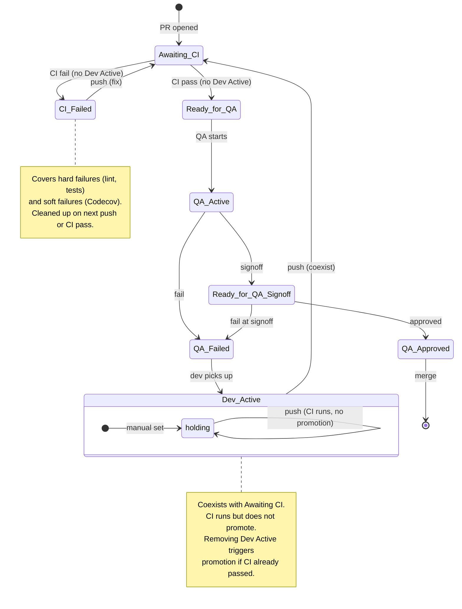

# PR Label State Machine Design

**Date:** 2026-03-30
**Status:** Approved
**Scope:** `.github/workflows/pr-labels.yml`, `.github/workflows/pr-labels-ci.yml`

## Problem

The PR label automation grew organically and had several bugs:
- `workflow_run` trigger fired on merges to main (no associated PR), causing failure emails
- `Dev Active` blocked `Awaiting CI` from being added, creating a dead end
- `opened` event was missing, so new PRs never received `Awaiting CI`
- `Ready for QA` didn't clean up `Awaiting CI`, allowing label coexistence
- No CI failure label — GitHub's soft failures (Codecov) aren't always blocking, but the team applies stricter standards
- `QA Invalidated` was added without user direction and adds complexity without value

These were discovered reactively across 4 incremental commits instead of being caught upfront.

## Design

### States

Exactly one workflow label is active at a time, except `Dev Active` which coexists with `Awaiting CI`.

| Label | Meaning |
|-------|---------|
| `Dev Active` | Dev is working on this PR. Don't promote even if CI passes. Set manually by the dev. |
| `Awaiting CI` | CI is running. Waiting for result. |
| `CI Failed` | CI failed (hard failure or soft/Codecov). Dev needs to fix. |
| `Ready for QA` | CI passed, QA can begin testing. |
| `QA Active` | QA is actively reviewing. |
| `Ready for QA Signoff` | QA finished review, waiting for sign-off decision. |
| `QA Failed` | QA found issues. Back to dev. |
| `QA Approved` | QA passed. Merge is unblocked (satisfies QA Gate check). |

### Removed

- `QA Invalidated` — removed entirely. Push resets labels and the PR comment is sufficient notification that QA's review was invalidated.

### State Diagram

### Dev Active Semantics

`Dev Active` is a **manual hold** that coexists with `Awaiting CI`:

- Dev sets `Dev Active` before pushing to signal they're not done
- Push adds `Awaiting CI` alongside `Dev Active` (both present)
- CI runs normally. If CI passes, `on-ci-pass` sees `Dev Active` and **does not promote**
- If CI fails with `Dev Active` present, **nothing happens** (dev is already working)
- When dev removes `Dev Active`, `on-unlabel` checks CI status:
  - CI already passed -> promote to `Ready for QA`
  - CI not passed -> `Awaiting CI` is already present, `on-ci-pass` will promote when CI passes

### Transition Rules

#### on-push (PR opened or synchronized)

Trigger: `pull_request: [opened, synchronize]`
File: `pr-labels.yml`

1. Remove all QA/workflow labels: `Ready for QA`, `Ready for QA Signoff`, `QA Approved`, `QA Active`, `QA Failed`, `CI Failed`
2. **Keep `Dev Active` if present** — don't remove it
3. Add `Awaiting CI` (unless already present)
4. If `QA Active` was present, add comment: "New commits pushed while QA was active."

#### on-ci-pass (CI completes successfully)

Trigger: `workflow_run: completed` (success, PR branch, not default branch)
File: `pr-labels-ci.yml`

1. Look up associated PR (API with 404 safety, fallback to branch search)
2. If no PR found, exit silently
3. If `Dev Active` present, exit (don't promote)
4. If `Awaiting CI` present: remove `Awaiting CI`, remove `CI Failed` if present, add `Ready for QA`

#### on-ci-fail (CI fails)

Trigger: `workflow_run: completed` (failure, PR branch, not default branch)
File: `pr-labels-ci.yml`

1. Look up associated PR (same pattern as on-ci-pass)
2. If no PR found, exit silently
3. If `Dev Active` present, exit (dev is already working)
4. If `Awaiting CI` present: remove `Awaiting CI`, add `CI Failed`

#### on-unlabel (Dev Active removed)

Trigger: `pull_request: unlabeled` where label is `Dev Active`
File: `pr-labels.yml`

1. Check if CI already passed for head commit
2. If CI passed: remove `Awaiting CI` if present, add `Ready for QA`
3. If CI not passed: ensure `Awaiting CI` is present (should already be)

#### on-label (cleanup rules)

Trigger: `pull_request: labeled` for specific labels
File: `pr-labels.yml`

| Label Added | Remove |
|-------------|--------|
| `Ready for QA` | `Awaiting CI`, `CI Failed` |
| `QA Active` | `Ready for QA` |
| `Dev Active` | `QA Failed`, `CI Failed`, `Awaiting CI`, `Ready for QA` |
| `Ready for QA Signoff` | `QA Active` |
| `QA Failed` | `QA Active`, `Ready for QA Signoff` |
| `QA Approved` | `Ready for QA Signoff` |

### Edge Cases

| Scenario | Behavior |
|----------|----------|
| Dev sets `Dev Active`, pushes 3 times | Each push resets `Awaiting CI`, `Dev Active` persists, CI runs but doesn't promote |
| Dev removes `Dev Active` after CI passed | `on-unlabel` promotes to `Ready for QA` |
| Dev removes `Dev Active` before CI passed | `Awaiting CI` already present, `on-ci-pass` promotes later |
| CI fails without `Dev Active` | `CI Failed` added, dev pushes fix -> `Awaiting CI` |
| CI fails with `Dev Active` | Nothing, dev is already working |
| QA fails, dev adds `Dev Active`, pushes fix | `Dev Active` cleans up `QA Failed`, push adds `Awaiting CI`, flow restarts |
| New PR opened without `Dev Active` | Straight to `Awaiting CI` |
| Codecov fails but GitHub doesn't block | `CI Failed` label makes stricter standard visible |
| QA fails at signoff stage | `QA Failed` removes `Ready for QA Signoff`, back to dev |

### File Structure

Two workflow files, split by trigger type:

- **`pr-labels.yml`** — `on: pull_request [opened, synchronize, labeled, unlabeled]`
  - Jobs: `on-push`, `on-unlabel`, `on-label`
- **`pr-labels-ci.yml`** — `on: workflow_run [completed]`
  - Jobs: `on-ci-pass`, `on-ci-fail`

Rationale: `workflow_run` fires on every CI completion (including merges to main). Separating it prevents noisy failures when there's no associated PR. The `head_branch != default_branch` filter plus safe 404 handling provide defense in depth.

### Known Limitation

`workflow_run`-triggered workflows always run from the default branch (main). Changes to `pr-labels-ci.yml` cannot be tested on a PR branch — they take effect only after merge. The `pull_request`-triggered jobs in `pr-labels.yml` DO run from the PR branch and can be tested normally.

### QA Gate

`qa-gate.yml` is unchanged. It sets a GitHub status check based on the `QA Approved` label. This is the merge gate — independent of the label automation.

